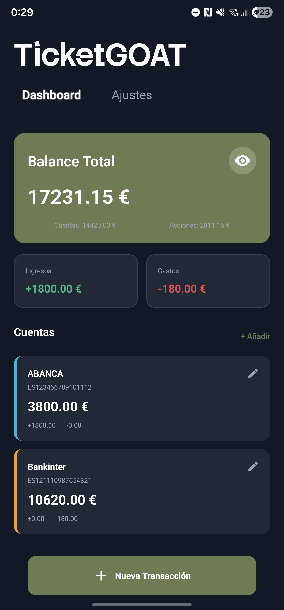
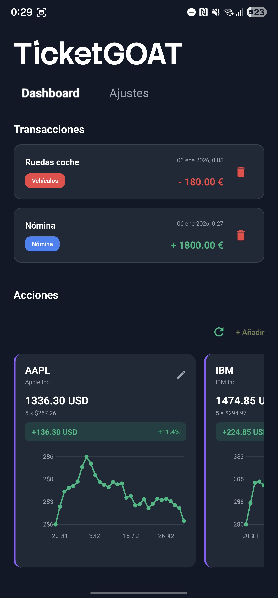
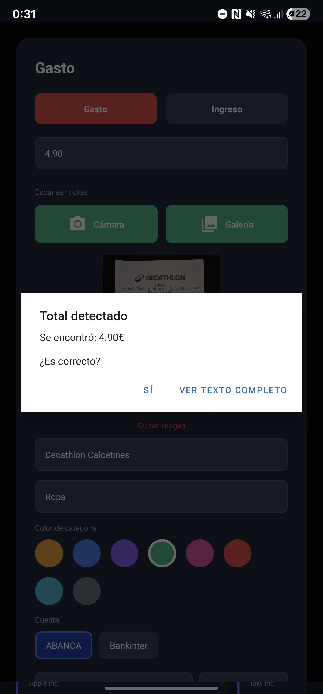
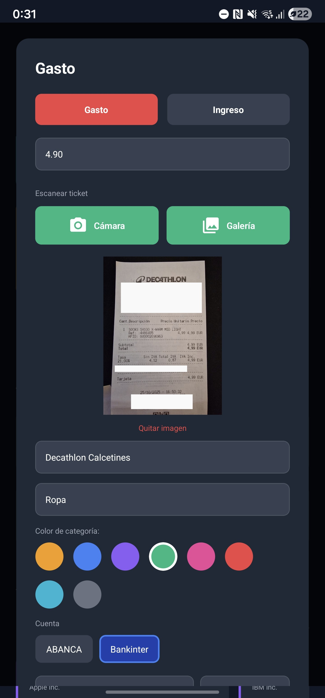
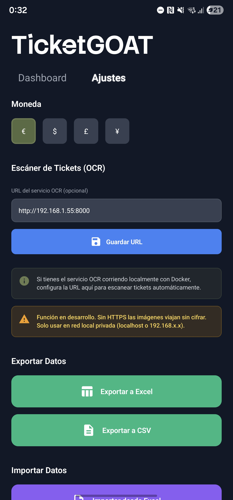
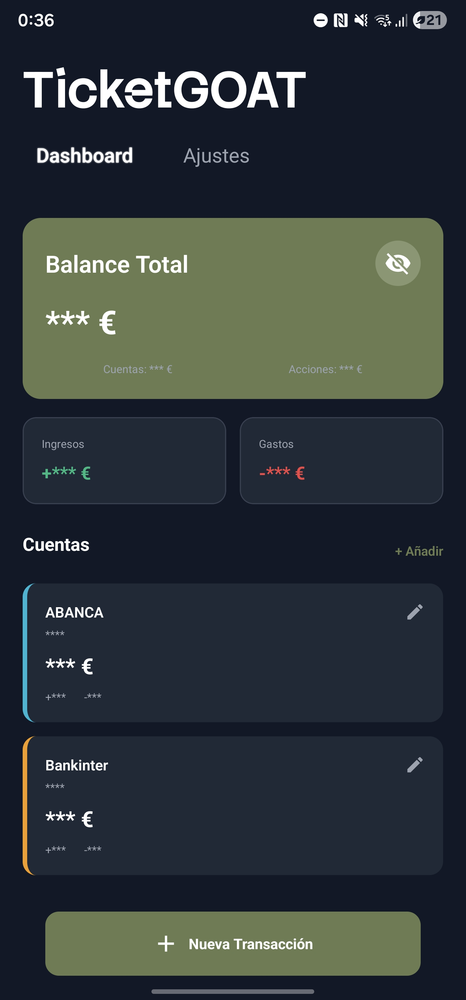

<div align="center">
  
  

  
  **Your Personal Finance Tracker**
  
  A modern, privacy-focused financial management app with OCR receipt scanning, investment tracking, and multi-account support.
  
  [](https://reactnative.dev/)
  [](https://expo.dev/)
  [](https://www.typescriptlang.org/)
  [](LICENSE)
  
  [Features](#features) • [Getting Started](#getting-started) • [Screenshots](#screenshots) • [Tech Stack](#tech-stack) • [Contributing](#contributing)

  <div align="center">
  
  
  </div>
  
</div>

---

> ## ⚠️ **IMPORTANT DISCLAIMER - BETA VERSION**
> 
> **This application is currently in BETA and under active development.**
> 
> ### 🔐 Data Security
> - All data is stored **locally on your device** with **AES encryption enabled by default**
> - Data is encrypted using industry-standard AES encryption via CryptoJS
> - Encryption keys are securely stored using Expo SecureStore (Keychain on iOS, KeyStore on Android)
> - You are responsible for maintaining device backups (uninstalling the app will lose the encryption key)
> - Exported Excel/CSV files are **NOT encrypted** - protect them appropriately
> - **No warranty is provided** regarding data loss, corruption, or unauthorized access
> - See [SECURITY.md](SECURITY.md) for detailed security information
> 
> ### 📊 Stock Price Accuracy
> - Stock prices are fetched from **Yahoo Finance API** for informational purposes only
> - Prices may be **delayed, inaccurate, or unavailable**
> - **DO NOT use this app for making investment decisions**
> - Always verify prices with official sources before executing trades
> - The developers are not liable for any financial losses
> 
> ### 🛡️ General Use
> - This software is provided "AS IS" without warranty of any kind
> - Use at your own risk
> - Not intended for commercial or professional financial management
> - Regular backups (export feature) are strongly recommended
> 
> **By using TicketGOAT, you acknowledge and accept these limitations.**

---

## ✨ Features

### 💰 Financial Management
- **Transaction Tracking** - Record income and expenses with customizable categories
- **Multiple Accounts** - Manage unlimited bank accounts with custom colours and IBAN
- **Period Filters** - View transactions by month or payroll period
- **Balance Overview** - Real-time balance calculation across all accounts

### 🎫 OCR Receipt Scanning
- **Automatic Total Detection** - Scan receipts and extract amounts automatically
- **Self-hosted Service** - Optional Docker-based OCR service (Python + Tesseract)
- **Privacy First** - All processing can be done locally

### 📈 Investment Tracking
- **Stock Portfolio** - Track your investments with real-time price updates
- **Performance Charts** - Visual representation of gains/losses
- **Auto-price Updates** - Fetch current stock prices from Yahoo Finance API (for informational purposes only)

> ⚠️ **Investment Disclaimer**: Prices may be delayed or inaccurate. Do not use for trading decisions. Always verify with official sources.


### 📊 Data Management
- **Excel Export** - Multi-sheet workbooks with summary, transactions, accounts, and stocks
- **CSV Export** - Universal format for data analysis
- **Import Support** - Restore data from Excel/CSV backups
- **Local Storage** - All data stays on your device
- **🔒 AES Encryption** - All data encrypted by default using AES with SecureStore keys

### 🎨 Modern UI/UX
- **Dark Theme** - Easy on the eyes with a sleek dark interface
- **Smooth Animations** - Gesture-based navigation between screens
- **Cross-Platform** - Works on iOS, Android, and Web
- **Unique branding** - Modern look for a modern app

---

## 🚀 Getting Started

### Prerequisites

- [Node.js](https://nodejs.org/) (v20 or higher)
- [npm](https://www.npmjs.com/) or [yarn](https://yarnpkg.com/)
- [Expo CLI](https://docs.expo.dev/get-started/installation/)

### Installation

1. **Clone the repository**
   ```bash
   git clone https://github.com/javilatte/ticket-goat.git
   cd ticket-goat
   ```

2. **Install dependencies**
   ```bash
   npm install
   ```

3. **Start the development server**
   ```bash
   npm start
   ```

4. **Run on your platform**
   - **iOS**: Press `i` or run `npm run ios`
   - **Android**: Press `a` or run `npm run android`
   - **Web**: Press `w` or run `npm run web`

---

## 📱 Screenshots

<div align="center">
  
  
  
</div>

<div align="center">
  
  
  
</div>

<div align="center">
  
</div>

---

## 🛠 Tech Stack

### Frontend
| Technology | Purpose |
|------------|---------|
| [React Native](https://reactnative.dev/) | Cross-platform mobile framework |
| [Expo SDK 54](https://expo.dev/) | Development toolchain and native APIs |
| [TypeScript](https://www.typescriptlang.org/) | Static type checking |
| [AsyncStorage](https://react-native-async-storage.github.io/async-storage/) | Local data persistence |
| [Expo Secure Store](https://docs.expo.dev/versions/latest/sdk/securestore/) | Encrypted key storage |
| [SheetJS CE](https://git.sheetjs.com/sheetjs/sheetjs) | Excel file generation |
| [Axios](https://axios-http.com/) | HTTP client |
| [React Native SVG](https://github.com/software-mansion/react-native-svg) | Charts and graphics |

### Backend (Optional OCR Service)
| Technology | Purpose |
|------------|---------|
| [Python 3.11](https://www.python.org/) | Runtime environment |
| [FastAPI](https://fastapi.tiangolo.com/) | REST API framework |
| [Tesseract OCR](https://github.com/tesseract-ocr/tesseract) | Text recognition engine |
| [Pillow](https://python-pillow.org/) | Image processing |
| [Docker](https://www.docker.com/) | Containerization |

---

## 🏗 Project Structure

```
ticket-goat/
├── assets/                 # Images, fonts, and static files
├── components/             # React components
│   ├── Dashboard.tsx
│   ├── TransactionModal.tsx
│   ├── SettingsScreen.tsx
│   └── ...
├── contexts/               # React Context providers
│   └── AppContext.tsx
├── hooks/                  # Custom React hooks
│   ├── useApp.ts
│   ├── useTransactions.ts
│   ├── useAccounts.ts
│   └── useStocks.ts
├── services/               # Business logic
│   ├── database.ts         # Local storage operations
│   ├── export.ts           # Excel/CSV export
│   └── stockApi.ts         # Stock price API
├── styles/                 # StyleSheet definitions
├── types/                  # TypeScript type definitions
├── ocr-service/            # Optional OCR backend
│   ├── Dockerfile
│   ├── main.py
│   └── requirements.txt
├── app.json                # Expo configuration
├── docker-compose.yml      # Docker orchestration
└── package.json
```

---

## 🐳 Docker Setup (Optional OCR Service)

### Quick Start with Docker Compose

```bash
docker-compose up -d
```

This starts:
- **OCR API**: http://localhost:8000
- **Web App**: http://localhost:3000

### OCR Service Only

```bash
cd ocr-service
docker build -t ticketgoat-ocr .
docker run -d -p 8000:8000 ticketgoat-ocr
```

### Configure in App

1. Open the app and go to **Settings**
2. Find "Receipt Scanner (OCR)" section
3. Enter OCR service URL:
   - Local: `http://localhost:8000`
   - Network: `http://192.168.x.x:8000`
4. Save and scan receipts from expense transactions

---

## 📖 Usage

### Adding Transactions

1. Tap the **"+ New Transaction"** button
2. Choose **Income** or **Expense**
3. Enter amount, description, and category
4. For expenses, optionally scan a receipt with OCR
5. Select account and save

### Managing Accounts

1. Add accounts with custom names and colors
2. Set initial balance and IBAN (optional)
3. Edit or delete accounts as needed

### Tracking Stocks

1. Expand the **"Stocks"** section on the dashboard by tapping on the title
2. Tap **"+ Add"** to create a new stock entry
3. Enter symbol (e.g., AAPL), quantity, and purchase price
4. Tap refresh icon to update current prices

### Exporting Data

1. Go to **Settings** → **Export Data**
2. Choose **Excel** or **CSV** format
3. Share via your device's native sharing options

---

## 📥 Download & Installation

### Android

Download the latest APK from the [Releases page](https://github.com/javilatte/ticket-goat/releases/latest).

1. Download `TicketGOAT-vX.X.X.apk`
2. Enable "Install from Unknown Sources" in your device settings
3. Open the APK file and install
4. Open TicketGOAT and start tracking your finances!

> **Note**: iOS support coming soon.

### Build from Source

See [Getting Started](#getting-started) section for development setup instructions.

---

## 🤝 Contributing

Contributions are welcome! Please follow these steps:

1. **Fork** the repository
2. **Create** a feature branch (`git checkout -b feature/AmazingFeature`)
3. **Commit** your changes (`git commit -m 'Add some AmazingFeature'`)
4. **Push** to the branch (`git push origin feature/AmazingFeature`)
5. **Open** a Pull Request

### Development Guidelines

- Follow TypeScript strict mode
- Use functional components with hooks
- Document code with JSDoc comments
- Keep components small and focused
- Write meaningful commit messages

---

## 🔒 Privacy & Security

- **100% Local Storage** - All data stays on your device using AsyncStorage
- **No Cloud Sync** - No external servers or tracking
- **No Encryption by Default** - AsyncStorage is unencrypted; device security is your responsibility
- **Optional Encryption** - Built-in encryption utilities available (must be manually enabled)
- **Optional OCR** - Self-host the OCR service if needed
- **Self-Hosted OCR** - Run the OCR service locally for complete privacy

> ⚠️ **OCR Security Notice**: The OCR service uses HTTP by default. Only use in local/trusted networks. HTTPS configuration required for production environments.

> 💡 **Recommendation**: Enable device encryption, use strong passwords/biometrics, and perform regular data exports as backups.

---

## 📄 License

This project is licensed under the MIT License - see the [LICENSE](LICENSE) file for details.

---

## 🙏 Acknowledgments

- **Stack Sans Notch** - Custom font for branding
- **Yahoo Finance API** - Free stock price data
- **Tesseract OCR** - Open-source text recognition
- **Expo Team** - Amazing development tools

---

## 📞 Support

- **Issues**: [GitHub Issues](https://github.com/javilatte/ticket-goat/issues)
- **Discussions**: [GitHub Discussions](https://github.com/javilatte/ticket-goat/discussions)

---

<div align="center">
  Made with ❤️ for personal finance management by the TicketGOAT team
</div>
